<div align="center">

# 🤖 AI Customer Support & Sales Agent

### A production-ready SaaS platform that answers from your PDFs, manages support tickets, and captures leads — powered by RAG + LLMs.

[](https://ai-customer-support-saas-rho.vercel.app)
[](https://ai-customer-support-saas-rho.vercel.app)
[](#tech-stack)

> **Built for freelance & client demos.** Drop in your PDFs, get an AI that answers customer questions from them — with citations, ticket management, analytics, and lead capture included.

</div>

---

## ✨ What It Does

Businesses have FAQs, policy docs, support tickets, and sales leads scattered across disconnected tools. This app brings the core workflow into one system:

| Role | Capabilities |
|------|-------------|
| 🧑‍💼 **Customer** | Register, open tickets, chat with the AI assistant |
| 🛠️ **Support Agent** | View, filter, and manage tickets across the pipeline |
| 👑 **Admin / Owner** | Analytics dashboard, PDF ingestion, lead tracking, email automation |

---

## 📸 Screenshots

### 🔐 Authentication — Role-based Login & Registration

> Clean login UI with Customer / Admin role switching and one-click demo logins.

<table>
  <tr>
    <td></td>
    <td>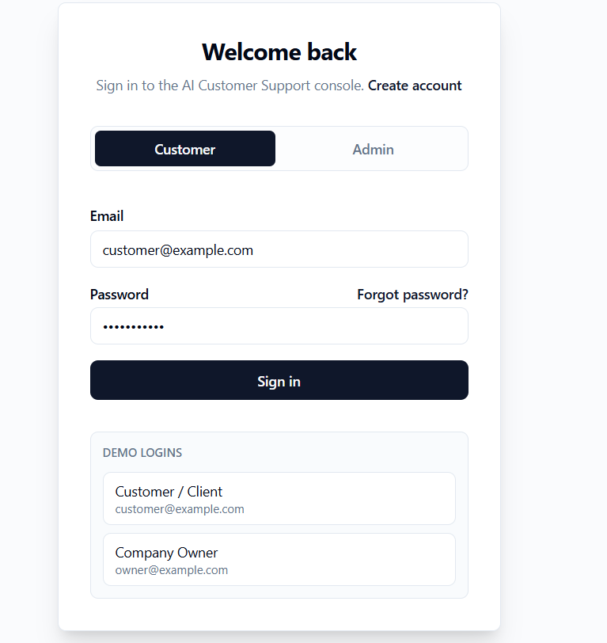</td>
    <td>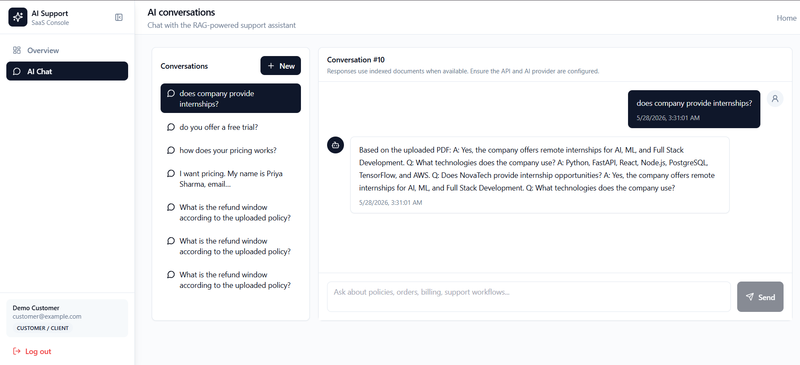</td>
  </tr>
  <tr>
    <td align="center"><em>Customer login</em></td>
    <td align="center"><em>Admin login</em></td>
    <td align="center"><em>Account registration</em></td>
  </tr>
</table>

<table>
  <tr>
    <td align="center">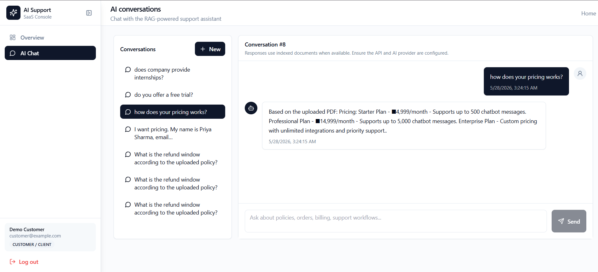</td>
  </tr>
  <tr>
    <td align="center"><em>Password reset with email confirmation toast</em></td>
  </tr>
</table>

---

### 💬 RAG-Powered AI Chat

> The AI answers directly from your uploaded PDFs — with source citations, conversation history, and persistent threads.

<table>
  <tr>
    <td>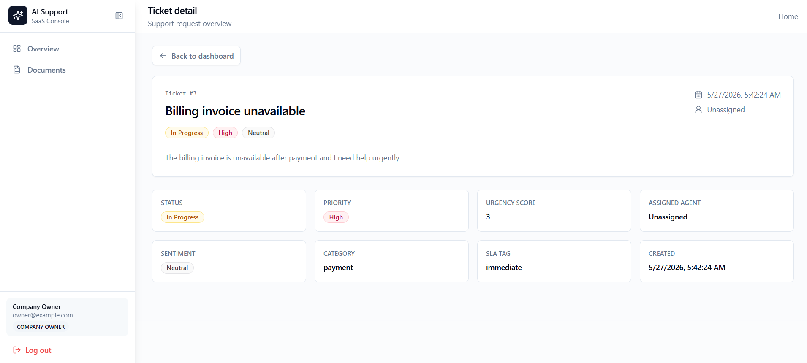</td>
    <td>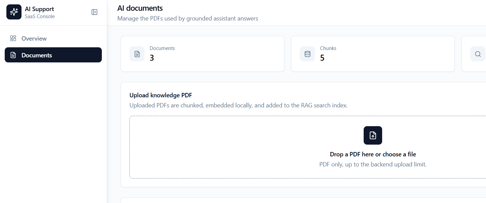</td>
  </tr>
  <tr>
    <td align="center"><em>"How does your pricing work?" — answered from uploaded PDF</em></td>
    <td align="center"><em>"Does the company offer internships?" — grounded in knowledge base</em></td>
  </tr>
</table>

---

### 📊 Admin Analytics Dashboard

> Real-time operations snapshot: ticket trends, priority heatmaps, sentiment distribution, lead pipeline, and email stats.

<table>
  <tr>
    <td>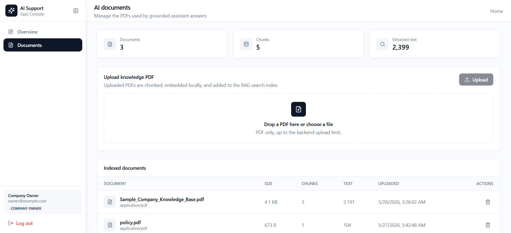</td>
    <td>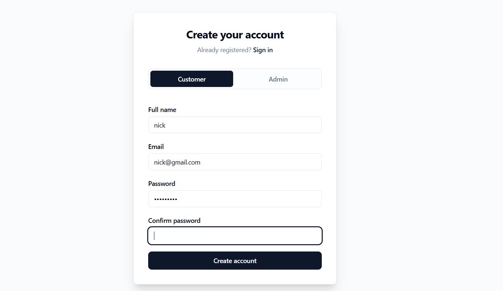</td>
  </tr>
  <tr>
    <td align="center"><em>KPIs: unique customers, escalations, open pipeline</em></td>
    <td align="center"><em>Ticket status, priority, sentiment + lead analytics</em></td>
  </tr>
</table>

---

### 🎫 Ticket Management

> Full ticket lifecycle — filtered list view with pagination, and a detailed view showing status, priority, sentiment, SLA tag, and agent assignment.

<table>
  <tr>
    <td>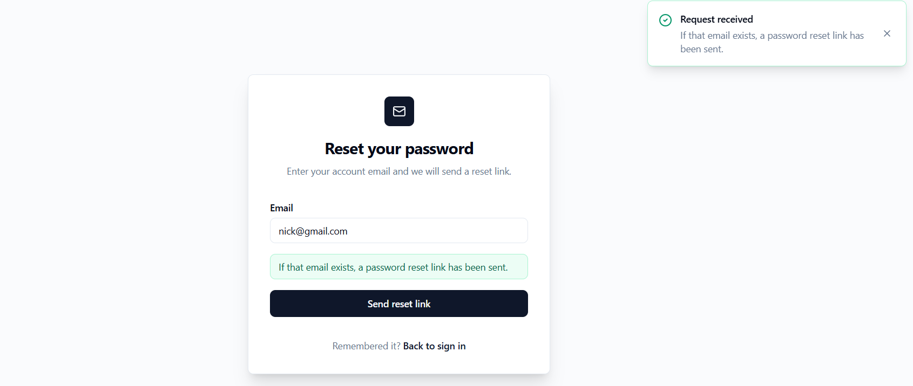</td>
    <td>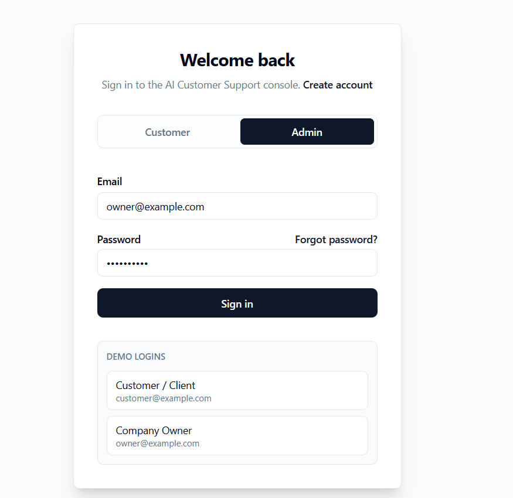</td>
  </tr>
  <tr>
    <td align="center"><em>Ticket list — filterable by status, priority, sentiment, agent</em></td>
    <td align="center"><em>Ticket detail — status, urgency score, SLA tag, category</em></td>
  </tr>
</table>

---

### 📄 PDF Knowledge Base (RAG Ingestion)

> Admins upload PDFs that are automatically chunked, embedded, and indexed into ChromaDB for retrieval-augmented generation.

<table>
  <tr>
    <td>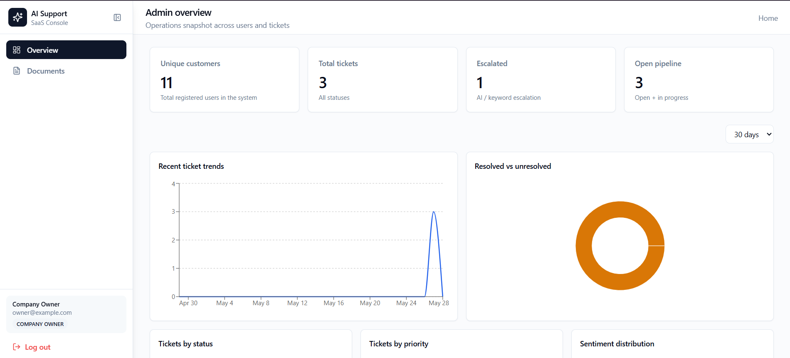</td>
    <td>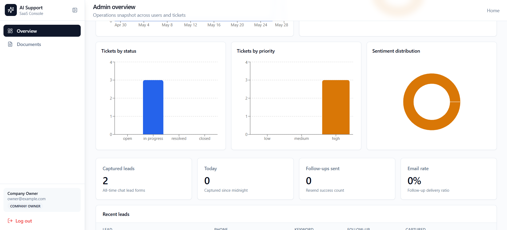</td>
  </tr>
  <tr>
    <td align="center"><em>3 indexed docs · 5 chunks · 2,399 extracted characters</em></td>
    <td align="center"><em>Drag-and-drop PDF upload → auto-chunked & embedded</em></td>
  </tr>
</table>

---

## 🏗️ Architecture

```
Browser (React + Vite + Tailwind)
        │
        │  REST / JSON
        ▼
FastAPI Backend
        ├── PostgreSQL      → users, tickets, conversations, leads
        ├── ChromaDB        → vector index for RAG retrieval
        ├── AI Provider     → Ollama (local) or OpenAI-compatible API
        └── Resend / SMTP   → transactional email (optional)
```

---

## 🛠️ Tech Stack

| Layer | Technology |
|-------|------------|
| **Frontend** | React 19, TypeScript, Vite, Tailwind CSS, React Router, Axios, Recharts |
| **Backend** | FastAPI, SQLAlchemy, Alembic, Pydantic, python-jose, passlib |
| **Database** | PostgreSQL (Supabase-compatible) |
| **AI / RAG** | ChromaDB · pypdf · Ollama or OpenAI-compatible embeddings + chat |
| **Email** | Resend API · Gmail SMTP fallback |
| **Testing** | Pytest (17 passing) · Vitest + React Testing Library (4 passing) |
| **Deploy** | Vercel (frontend) · Render (backend via `render.yaml`) |

---

## 🚀 Quick Start

### Prerequisites
- Node.js 20+, Python 3.12+, PostgreSQL
- Ollama (local dev) or an OpenAI-compatible API key

### 1. Backend
```bash
cd backend
python -m venv .venv && .venv\Scripts\activate
pip install -r requirements.txt -r requirements-dev.txt
copy .env.example .env
# Set DATABASE_URL and JWT_SECRET in .env
alembic upgrade head
python scripts/seed_demo_users.py
uvicorn main:app --reload --host 0.0.0.0 --port 8000
```

### 2. AI Provider
```bash
# Local (Ollama)
ollama pull mistral && ollama pull nomic-embed-text && ollama serve

# Or use OpenAI-compatible API
AI_PROVIDER=openai
OPENAI_API_KEY=your-key
OPENAI_CHAT_MODEL=gpt-4o-mini
OPENAI_EMBEDDING_MODEL=text-embedding-3-small
```

### 3. Frontend
```bash
cd frontend
npm install
copy .env.example .env.local
# Set VITE_API_URL=http://127.0.0.1:8000
npm run dev
# Opens at http://localhost:5173
```

### Demo Accounts

| Role | Email | Password |
|------|-------|----------|
| Customer | `customer@example.com` | `Customer123` |
| Company Owner | `owner@example.com` | `Owner12345` |
| Support Agent | `support@example.com` | `Support123` |

---

## ✅ Verified Test Status

```bash
# Backend — 17 passing
cd backend && python -m pytest tests

# Frontend — 4 passing + production build
cd frontend && npm test && npm run build
```

---

## 🏭 Production Readiness

- ✅ JWT auth with forgot/reset password flows
- ✅ Role-based access control (customer / agent / admin)
- ✅ Production startup validation (requires `DATABASE_URL`, `JWT_SECRET`, non-localhost CORS)
- ✅ Global exception handlers with consistent JSON error responses
- ✅ `X-Request-ID` headers on all responses for tracing
- ✅ Graceful AI/email failure handling — errors return clean API messages, never crash the process
- ✅ Alembic migrations for zero-downtime schema updates
- ✅ Structured logging with configurable log level

See [`docs/PRODUCTION_READINESS.md`](docs/PRODUCTION_READINESS.md) for the full checklist.

---

## 📁 Repository Layout

```
.
├── backend/
│   ├── ai/          # RAG pipeline, PDF parsing, embeddings, ChromaDB
│   ├── alembic/     # Database migrations
│   ├── models/      # SQLAlchemy ORM models
│   ├── routes/      # API routers (auth, tickets, chat, docs, leads)
│   ├── schemas/     # Pydantic schemas
│   ├── services/    # Email, AI provider integrations
│   └── tests/       # Pytest suite (17 passing)
├── frontend/
│   └── src/         # React 19 + TypeScript app
├── docs/
│   ├── PORTFOLIO_CASE_STUDY.md
│   ├── PRODUCTION_READINESS.md
│   ├── UPWORK_CLIENT_OFFER.md
│   └── screenshots/
├── render.yaml      # One-click Render deploy
└── .env.example
```

---

## 🎯 Portfolio Positioning

> **Built a full-stack AI support SaaS** with role-based dashboards, ticket workflows, PDF-grounded chat with citations, lead capture, email automation, and production validation — deployed and live.

- [`docs/PORTFOLIO_CASE_STUDY.md`](docs/PORTFOLIO_CASE_STUDY.md) — resume bullets, interview talking points, project narrative
- [`docs/UPWORK_CLIENT_OFFER.md`](docs/UPWORK_CLIENT_OFFER.md) — first-client offer, proposal template, package structure

---

## 📜 License

Use and adapt for learning, portfolio, and client-demo purposes. Replace branding, domains, demo data, and secrets before any real production deployment.
